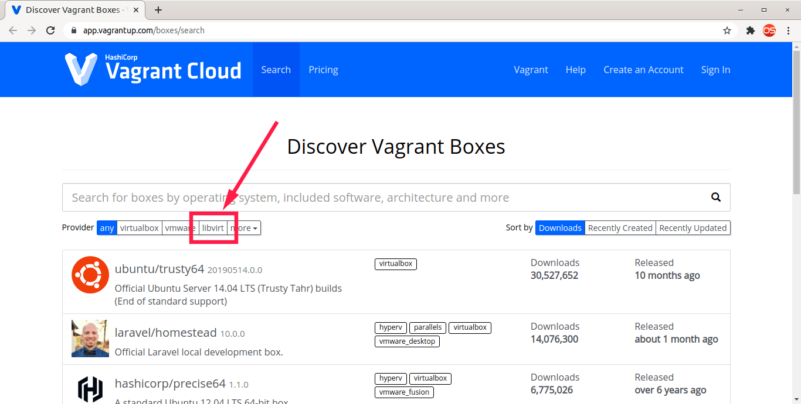
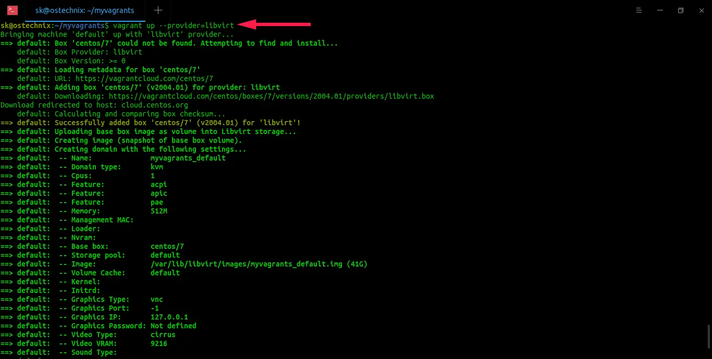

# Warewulf v4 Provisioning with Vagrant

## Introduction

Vagrant project to provision a Warewulf v4 cluster running CentOS 8 and Rocky 8.

- `mgr` - warewulf headnode
- `cn0` - warewulf compute node 0
- `cn1` - warewulf compute node 1

This guide works mostly with `libvirt` KVM/QEMU, so, if you prefer to work with VirtualBox, take a look at the [original project ](https://github.com/tcooper/warewulf-vagrant). Also, you must switch back all references to VirtualBox in files all over the project structure.

## Prerequisites

You need working `libvirt` as well KVM/QEMU and Vagrant installations to use this repository primarily. Further instructions for installing all dependencies are described in the following sections. `virt-manager` is opitional, as you can use whatever GUI you like to manage your virtual machines, or none of it.

All capabilities were developed and tested with:

* Operating systems: 
  - [ ] macOS 11.2.3 
  - [X] Debian 10 (Buster)
* Providers
  - [ ] Oracle VirtualBox 6.1.18 r142142 (without VirtualBox 6.1.18 Oracle VM VirtualBox Extension Pack) 
  - [X] libvirt-KVM/QEMU with `virt-manager`
* Vagrant versions 
  - [ ] 2.2.15
  - [X] 2.2.16

#### Support for libvirt - KVM/QEMU

Not everyone likes to play with VirtualBox, and prefer to go with libvirt-KVM/QEMU. For this case, `virt-manager` is being used as the UI manager for VM's. 

The following steps are necessary for using this bootstrapping test suite with libvirt-KVM/QEMU as of [this article](https://ostechnix.com/how-to-use-vagrant-with-libvirt-kvm-provider/). For MacOS users, [this article](https://lunar.computer/posts/vagrant-libvirt-macos/) can help with that, but, this is by your own risk, as some users has reported some issues on this. Check [1](https://github.com/vagrant-libvirt/vagrant-libvirt/issues/818) and [2](https://www.reddit.com/r/devops/comments/ds6zl2/tutorial_install_vagrantlibvirt_on_macos_to/) for further investigations and tips to work on macOS. 

Here we go :

1. Install core dependencies for `vagrant` and `libvirt` work together

* 1.1. Install dependencies for `vagrant-libvirt` :

``` 
sudo apt install qemu libvirt-daemon-system libvirt-clients libxslt-dev libxml2-dev libvirt-dev zlib1g-dev ruby-dev ruby-libvirt ebtables dnsmasq-base
``` 

* 1.2. Install `vagrant-libvirt` plugin :

``` 
vagrant plugin install vagrant-libvirt
```  

* 1.3. Install `vagrant-mutate` to get `vagrant` boxes working with other providers :

```  
vagrant plugin install vagrant-mutate
```  

2. Check if Vagrant is working with `libvirt` KVM provider

* 2.1. Verify which boxes are support by `libvirt` in this [link](https://app.vagrantup.com/boxes/search?provider=libvirt).

Source : https://ostechnix.com/how-to-use-vagrant-with-libvirt-kvm-provider/


* 2.2. Test `centos` and `rocky` boxes with `libvirt` :

CentOS 8:
```  
vagrant init centos/8
```  

Rocky 8:
```
vagrant init rockylinux/8  
```

* 2.3. Start the virtual machine :

```  
vagrant up --provider=libvirt
```  


Source : https://ostechnix.com/how-to-use-vagrant-with-libvirt-kvm-provider/


As an alternative, is possible to permanently use `libvirt` as default provider exporting environment variable :

```  
export VAGRANT_DEFAULT_PROVIDER=libvirt
``` 

If you want to take a deeper look on `libvirt` and Vagrant, [this](https://github.com/vagrant-libvirt/vagrant-libvirt) has more informations and guidance.

## Quick Start

If you don't want to (re)configure anything and just want to bring up the manager node and some compute nodes then:

### Provision everything in one go...

```
./bootstrap.sh
vagrant up
```

In testing, the entire 3 node cluster was fully provisioned and running in under 9 minutes with manager node install and configuration taking the bulk (8 minutes) of that time. Compute nodes boot diskless in under a minute.

## Tips

*   Preparation of the base system is handled in [`mgr/warewulf_pre.sh`](./mgr/warewulf_pre.sh)
*   Install of Warewulf v4 based on the [Quick Start for RHEL, CentOS and Rocky 8](https://docs.ctrliq.com/warewulf/docs/getting-started/quickstart-el8) is handled in [`mgr/warewulf_install.sh`](./mgr/warewulf_install.sh)
*   Configuration based on the [Quick Start for RHEL, CentOS and Rocky 8](https://docs.ctrliq.com/warewulf/docs/getting-started/quickstart-el8) is handled in [`mgr/warewulf_config.sh`](./mgr/warewulf_config.sh)
*   Customization through creation of a second container image using [Singularity CE](https://singularity.hpcng.org/) is handled in [`mgr/warewulf_container.sh`](./mgr/warewulf_container.sh)
